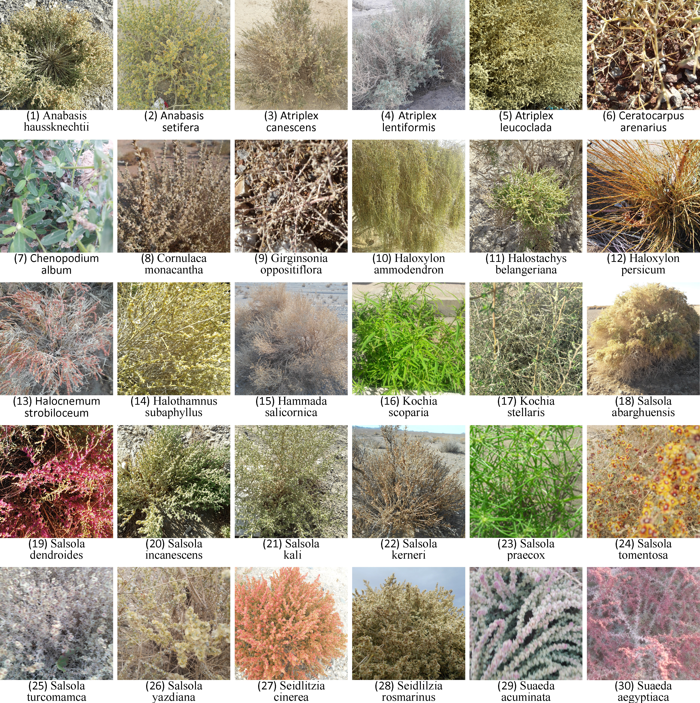

# ACHENY: A Standard Chenopodiaceae Image Dataset


[](https://www.researchgate.net/publication/355225478_ACHENY_A_Standard_Chenopodiaceae_Image_dataset_for_Deep_Learning_Models)
[](https://data.mendeley.com/datasets/fpfty8nn7j/1)
[](https://creativecommons.org/licenses/by/4.0/)

**ACHENY** (Autumn Chenopod of Yazd) is a standardized image dataset of Chenopodiaceae plants, curated to advance deep learning research in botanical identification and biodiversity monitoring.

## 📌 Overview
Identifying species within the Chenopodiaceae family is historically challenging due to high morphological similarities. This dataset provides **27,030 high-resolution images** across **30 species**, captured in real-world desert and semi-desert conditions in the Yazd province of Iran.

### Key Features:
* **Diverse Conditions:** Captured under varying sunlight, wind, viewpoints, and distances.
* **Standardized Format:** RGB images resized to **224 x 224 pixels** (with 64 x 64 versions also available).
* **Expert Labeling:** Collected from multiple bushes per species to ensure high intra-species variety.

## 🌿 Species List & Taxonomy
The dataset contains 30 species collected from various habitats.

| Row | Class ID | Scientific Name | Natural Habitat Area Studied |
| :--- | :--- | :--- | :--- |
| 1 | **AnaHau** | *Anabasis haussknechtii* Bge. ex Boiss. | Around Nodooshan |
| 2 | **AnaSet** | *Anabasis setifera* Moq. | Desert areas around Yazd |
| 3 | **AtrCan** | *Atriplex canescens* (Pursh) Nutt. | Cultivated between Ardakan and Yazd |
| 4 | **AtrLen** | *Atriplex lentiformis* (Torr.) S. Watds. | Cultivated in Chah-Afzal of Ardakan |
| 5 | **AtrLeu** | *Atriplex leucoclada* (Boiss.) Aellen | Desert areas around Yazd, Ardakan, and Meybod |
| 6 | **CerAre** | *Ceratocarpus arenarius* L. | Around Taft (Shirkooh) |
| 7 | **CheAlb** | *Chenopodium album* L. | Yazd province among farms and gardens |
| 8 | **CorMon** | *Cornulaca monacantha* Delile | Between Yazd and Ardakan |
| 9 | **GirOpp** | *Girgensonia oppositiflora* (Pall.) Fenzl. | Around Mehriz |
| 10 | **HalAmm** | *Haloxylon ammodendron* (C. A. Mey.) Bge. | Wide area of Yazd Deserts |
| 11 | **HalBel** | *Halostachys belangeriana* (Moq.) Botsch. | Abarkuh deserts |
| 12 | **HalPer** | *Haloxylon persicum* Bge. ex Boiss. | From Mehriz to Marvast |
| 13 | **HalStr** | *Halocnemum strobilaceum* (Pall.) M. B. | Salt marshes around Behabad and Aghda |
| 14 | **HalSub** | *Halothamnus subaphyllus* (C. A. Mey.) Botsch. | Around Chadormaloo |
| 15 | **HamSal** | *Hammada salicornica* (Moq.) Iljin | Yazd-Bafgh road |
| 16 | **KocSco** | *Kochia scoparia* (L.) Schrad. | Often as weed in parks |
| 17 | **KocSte** | *Kochia stellaris* Moq. | Yazd to Ardakan |
| 18 | **SalAba** | *Salsola abarghuensis* Assadi | North of Abarkuh desert (Endemic to Iran) |
| 19 | **SalDen** | *Salsola dendroides* Pall. | Between Marvast and Harat |
| 20 | **SalInc** | *Salsola incanescens* C. A. Mey. | Around the road of Yazd-Ardakan |
| 21 | **SalKal** | *Salsola kali* L. | Often as weed in different areas of Yazd |
| 22 | **SalKer** | *Salsola kerneri* (Wol.) Osczak. Botsch. | Desert areas around Nodooshan |
| 23 | **SalPra** | *Salsola praecox* Litw. | Sand dunes around Ardakan |
| 24 | **SalTom** | *Salsola tomentosa* (Moq.) Spach. | Across the Yazd desert areas |
| 25 | **SalTur** | *Salsola turcomanica* (Litv.) Freitag. | Ardakan Around |
| 26 | **SalYaz** | *Salsola yazdiana* Assadi | Around Kharanagh (Endemic to Iran) |
| 27 | **SeiCin** | *Seidlitzia cinerea* (Moq.) Bge & Botsch. | Eastern areas of Yazd |
| 28 | **SeiRos** | *Seidlitzia rosmarinus* (Ehrenb.) Bge. ex Boiss. | Beside Yazd-Ardakan Road |
| 29 | **SuaAcu** | *Suaeda acuminata* (C. A. Mey.) Moq. | Around Ardakan |
| 30 | **SuaAeg** | *Suaeda aegyptiaca* (Hasselq.) Zohary | Around Ardakan |

---

## 📚 Research & Publications

The following publications detail the creation of the ACHENY dataset and the development of deep learning models optimized for its classification.

### 1. Primary Dataset Paper
> **ACHENY: A Standard Chenopodiaceae Image dataset for Deep Learning Models** > *A. Heidary-Sharifabad, M. Sardari Zarchi, S. Emadi, & G. Zarei (2021)* > **Journal:** Data in Brief, 39, 107478. [DOI: 10.1016/j.dib.2021.107478]

### 2. Deep Learning Benchmarks
> **Efficient Deep Learning Models for Categorizing Chenopodiaceae in the Wild** > *A. Heidary-Sharifabad, M. Sardari Zarchi, S. Emadi, & G. Zarei (2021)* > **Journal:** Int. J. of Pattern Recognition and Artificial Intelligence, 35(10). [DOI: 10.1142/S0218001421520157]

### 3. Padeep: Patched Deep Learning
> **Padeep: A Patched Deep Learning Based Model for Plants Recognition on Small Size Dataset: Chenopodiaceae Case Study** > *A. Heidary-Sharifabad, M. Sardari Zarchi, & G. Zarei (2022)* > **Journal:** Int. J. of Computational Intelligence and Applications, 21(01). [DOI: 10.1142/S1469026822500055]

---

## 📖 BibTeX
If you use the ACHENY dataset or the related models in your research, please cite:

```bibtex
@article{acheny2021,
  title={ACHENY: A Standard Chenopodiaceae Image dataset for Deep Learning Models},
  author={Heidary-Sharifabad, Ahmad and Sardari Zarchi, Mohsen and Emadi, Sima and Zarei, Gholamreza},
  journal={Data in Brief},
  volume={39},
  pages={107478},
  year={2021},
  publisher={Elsevier}
}

@article{efficient_acheny2021,
  title={Efficient Deep Learning Models for Categorizing Chenopodiaceae in the Wild},
  author={Heidary-Sharifabad, Ahmad and Sardari Zarchi, Mohsen and Emadi, Sima and Zarei, Gholamreza},
  journal={International Journal of Pattern Recognition and Artificial Intelligence},
  volume={35},
  number={10},
  pages={2152015},
  year={2021}
}

@article{padeep2022,
  title={Padeep: A Patched Deep Learning Based Model for Plants Recognition on Small Size Dataset: Chenopodiaceae Case Study},
  author={Heidary-Sharifabad, Ahmad and Sardari Zarchi, Mohsen and Zarei, Gholamreza},
  journal={International Journal of Computational Intelligence and Applications},
  volume={21},
  number={01},
  year={2022}
}
```

---

## 🚀 Data Access
The full dataset is hosted on **Mendeley Data**:  
[**Download ACHENY Dataset**](https://data.mendeley.com/datasets/fpfty8nn7j/1)

> 🖼️ **Looking for High-Resolution images?** Original uncompressed files are available for research purposes. See [DATA_REQUEST.md](./Images/DATA_REQUEST.md) for details.

### 📄 License
The dataset is licensed under a [Creative Commons Attribution 4.0 International License (CC BY 4.0)](https://creativecommons.org/licenses/by/4.0/).
```
